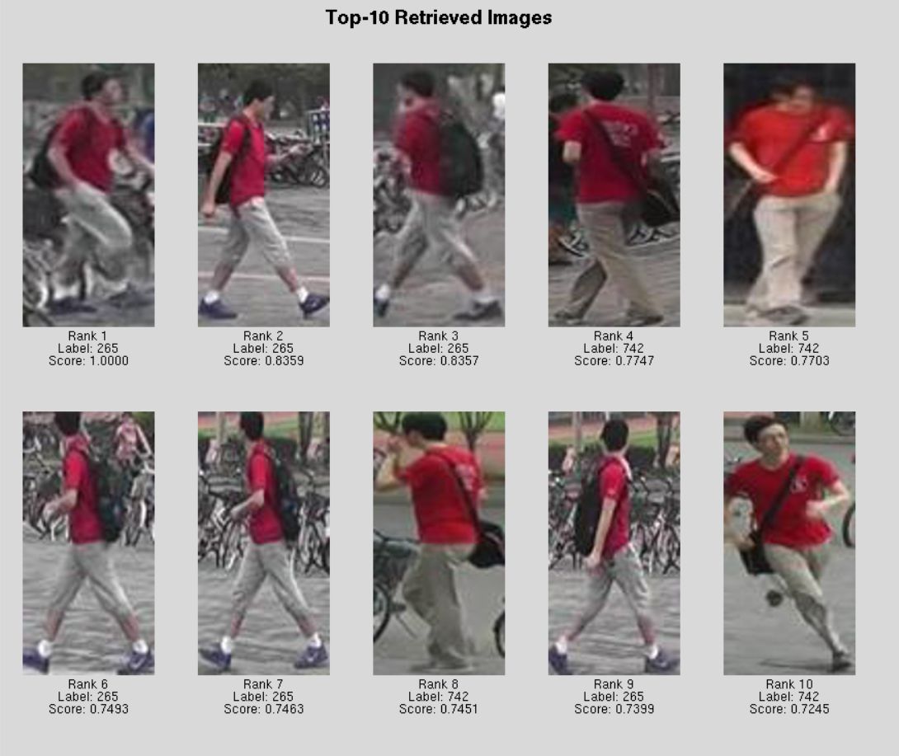
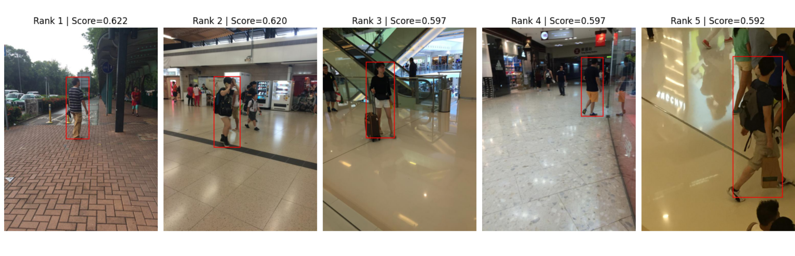

# Person Search and ReIdentification Pipeline

This repository implements a **person classification and re-identification (ReID) pipeline** using a **Vision Transformer (ViT)** trained from scratch with **triplet loss**. The system supports training, inference, and retrieval.

## Project Structure

├── Data/ # Dataset loaders and processing <br />
├── Model/ # Model architecture and supporting scripts <br />
├── Utils/ # Utility functions <br />
├── Inference.py # Script for running inference on test images <br />
├── Retrive.py # Script for running retrieval given a query <br />
├── Train.py # Training pipeline <br />
├── config.py # Configuration of hyperparameters and paths <br />

## Installation 
### Option 1: Using Conda
```bash
conda env create -f environment.yml
conda activate reid
```
### Option 2: Using Pip
```bash
pip install -r requirements.txt
```
## Usage
Train the Vit model from scratch using
```bash
python Train.py
```
Test and Retrieve using 
```bash
python Inference.py
python Retrieve.py
```

## Outputs 
### Reidentification outputs

### Search outputs


